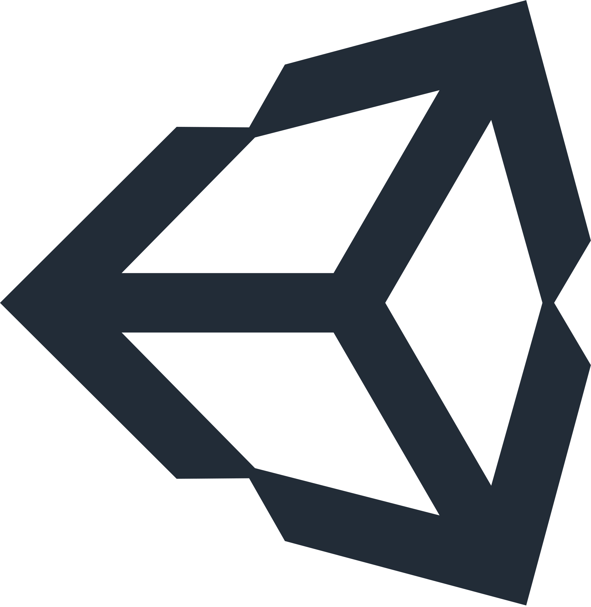

# About me
!(image)[https://www.codewars.com/users/abenteuerzeit/badges/large]

🔭 Currently seeking **junior developer** role as I complete my 12-month full stack development training at [Codecool](https://github.com/CodecoolGlobal).

I am a highly skilled translator, teacher, mentor and proofreader who specializes in the Aesthetics and Philosophy of Art, fluent in three languages and working to master my .NET Full Stack developer skills.

### Contact Me

Open for collaboration opportunities.

- Phone numbers: [+1 (443) 216-9316](tel:+14432169316), [+48 535-322-909](tel:+48535322900)
- Profiles: [LinkedIn](www.linkedin.com/in/abenteuerzeit/), [Gitlab](gitlab.com/abenteuerzeit), [ORCID](https://orcid.org/0000-0001-6813-7490)

Additional information can be found beneath my profile picture on the left.

### Github Stats

#### Hard Skills

<!-- 

 
-->

  <figure style="margin: 1.6110vw; text-align: center; position: relative;">
    
    <!-- <figcaption style="text-align:center; font-style: italic; font-size: smaller;">Python</figcaption> -->
  </figure>
  <figure style="margin: 1.6110vw; text-align: center; position: relative;">
    
    <!-- <figcaption style="text-align:center; font-style: italic; font-size: smaller;">Flask</figcaption> -->
  </figure>
  <figure style="margin: 1.6110vw; text-align: center; position: relative;">
    
    <!-- <figcaption style="text-align:center; font-style: italic; font-size: smaller;">Jinja</figcaption> -->
  </figure>
  <figure style="margin: 1.6110vw; text-align: center; position: relative;">
    
    <!-- <figcaption style="text-align:center; font-style: italic; font-size: smaller;">C sharp</figcaption> -->
  </figure>
  <figure style="margin: 1.6110vw; text-align: center; position: relative;">
    
    <!-- <figcaption style="text-align:center; font-style: italic; font-size: smaller;">git</figcaption> -->
  </figure>
  <figure style="margin: 1.6110vw; text-align: center; position: relative;">
    
    <!-- <figcaption style="text-align:center; font-style: italic; font-size: smaller;">HTML</figcaption> -->
  </figure>
  <figure style="margin: 1.6110vw; text-align: center; position: relative;">
    
    <!-- <figcaption style="text-align:center; font-style: italic; font-size: smaller;">CSS</figcaption> -->
  </figure>
  <figure style="margin: 1.6110vw; text-align: center; position: relative;">
    
    <!-- <figcaption style="text-align:center; font-style: italic; font-size: smaller;">Bootstrap</figcaption> -->
  </figure>
  <figure style="margin: 1.6110vw; text-align: center; position: relative;">
    
    <!-- <figcaption style="text-align:center; font-style: italic; font-size: smaller;">JavaScript</figcaption> -->
  </figure>
  <figure style="margin: 1.6110vw; text-align: center; position: relative;">
    
    <!-- <figcaption style="text-align:center; font-style: italic; font-size: smaller;">React Native</figcaption> -->
  </figure>
  <figure style="margin: 1.6110vw; text-align: center; position: relative;">
    
    <!-- <figcaption style="text-align:center; font-style: italic; font-size: smaller;">Redux</figcaption> -->
  </figure>
  <figure style="margin: 1.6110vw; text-align: center; position: relative;">
    
    <!-- <figcaption style="text-align:center; font-style: italic; font-size: smaller;">Node</figcaption> -->
  </figure>
  <figure style="margin: 1.6110vw; text-align: center; position: relative;">
    
    <!-- <figcaption style="text-align:center; font-style: italic; font-size: smaller;">SQL Server</figcaption> -->
  </figure>
  <figure style="margin: 1.6110vw; text-align: center; position: relative;">
    
    <!-- <figcaption style="text-align:center; font-style: italic; font-size: smaller;">.NET Core</figcaption> -->
  </figure>
  <figure style="margin: 1.6110vw; text-align: center; position: relative;">
    
    <!-- <figcaption style="text-align:center; font-style: italic; font-size: smaller;">PostgreSQL</figcaption> -->
  </figure>
  <figure style="margin: 1.6110vw; text-align: center; position: relative;">
    
    <!-- <figcaption style="text-align:center; font-style: italic; font-size: smaller;">Unity</figcaption> -->
  </figure>

***

## Self Definition

As a multilingual artist, musician, actor, and language specialist with a strong background in music and philosophy, I am highly skilled in both creative and analytical thinking. I am currently working towards becoming a .NET Full Stack programmer, and have already gained experience in technical support, web development, and research. I have a proven track record of teachingm and working in the music industry, and have demonstrated my ability to excel in fast-paced, dynamic environments. I am fluent in English, Polish, and French, and have successfully used these language skills as a translator, proofreader, and English language teacher. I am passionate about using my unique set of skills and knowledge to make a positive impact on the world, and am excited to bring my diverse background and expertise to a company that values innovation and excellence.

## Strength

I am a highly skilled and motivated individual with a strong background in the arts and philosophy, as well as technical experience in web development, technical support, and research. I have a strong foundation in computer programming, with proficiency in technologies such as .NET, HTML, CSS, JavaScript, and more. I am also proficient in multiple languages, including English, Polish, and French, and have experience as a translator, proofreader, and language teacher. I am a natural problem-solver with excellent communication skills and a passion for helping others. I am confident that my diverse skillset and determination make me an excellent fit for any junior developer role

### Mentor Opinion

> I've worked with Adrian during his time as a student in Codecool. He presented himself as ambitious, detail-oriented individual. He poses unique skill set and I recommend him.”
> — Kamil Grondys, mentor

### Recent Projects

## Work Experience

- lecturer (2021 - ) — Jan Matejko Academy of Fine Arts 
- Senior Technical Support Specialist (2020 - None) — Jagiellonian University 
- lecturer (2017 - 2021) — Jagiellonian University 
- Webmaster (2017 - ) — Maria Curie-Skłodowska University 
- Associate Editor, Proofreader, Webmaster (2017 - None) — The Polish Journal of
Aesthetics

## Education

- Doctor of Humanities in Philosophy (2017 - 2021) — Jagiellonian University 
- M.D. (2015 - 2017) — Jagiellonian University 
- B.A. (2012 - 2015) — Adam Mickiewicz University 
- B.A. (2006 - 2009) — Paderewski Academy of Music 
- Sound Engineer (2010 - 2012) — Regional Education Cente

## Language Skills

1. &#127482;&#127480; English — Native Speaker
2. &#127477;&#127473; Polish — Native Speaker
3. &#127467;&#127479; French — Advanced
4. &#127468;&#127479; Ancient Greek — Intermediate
5. &#127465;&#127466; German — Lower Intermediate

<!--
**abenteuerzeit/abenteuerzeit** is a ✨ _special_ ✨ repository because its `README.md` (this file) appears on your GitHub profile.

Here are some ideas to get you started:

- 🔭 I’m currently working on ...
- 🌱 I’m currently learning ...
- 👯 I’m looking to collaborate on ...
- 🤔 I’m looking for help with ...
- 💬 Ask me about ...
- 📫 How to reach me: ...
- 😄 Pronouns: ...
- ⚡ Fun fact: ...
-->
